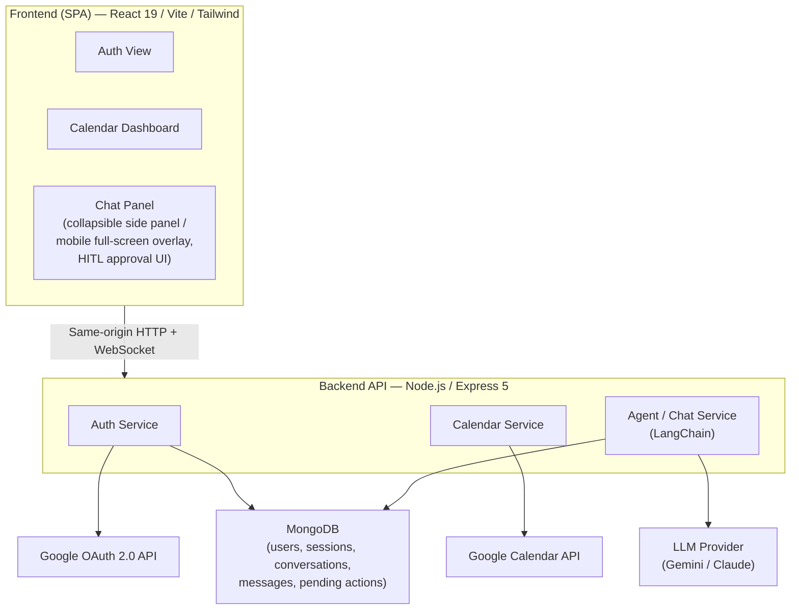
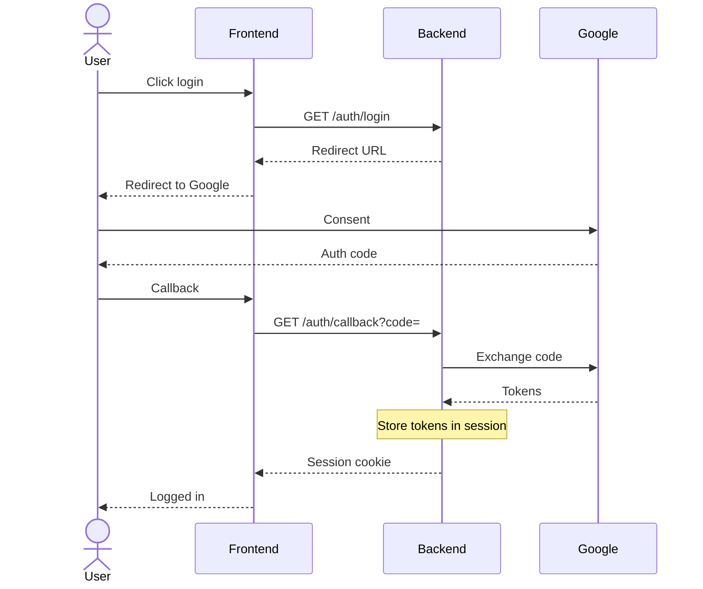
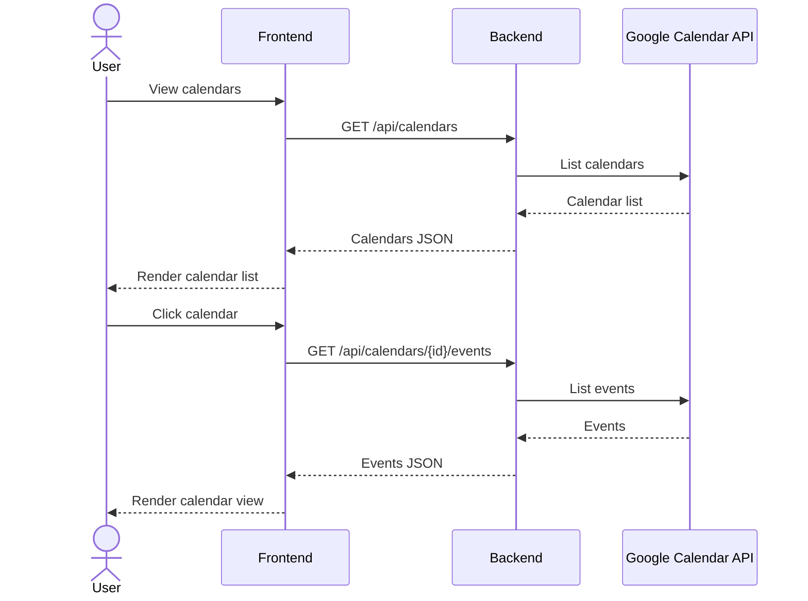
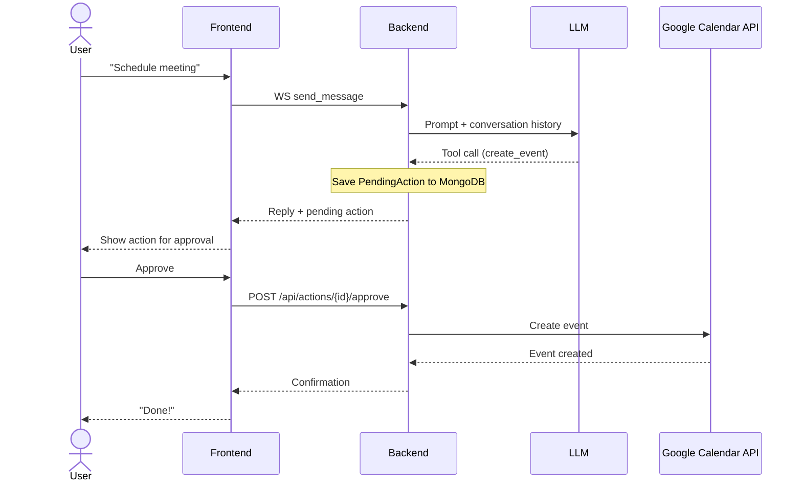
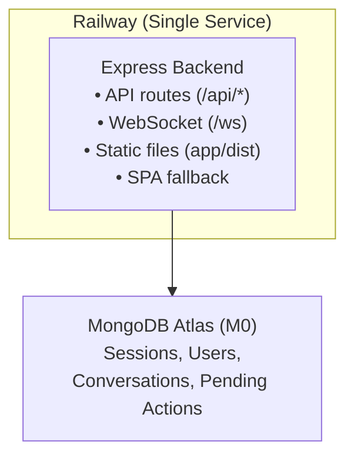

# System Design — Calendar Assistant

## Architecture Overview



## Data Models

### User

| Field          | Type   | Description                        |
|----------------|--------|------------------------------------|
| id             | string | Primary key (Google subject ID)    |
| email          | string | Google account email               |
| display_name   | string | User's display name                |
| access_token   | string | OAuth access token (encrypted)     |
| refresh_token  | string | OAuth refresh token (encrypted)    |
| token_expiry   | datetime | Token expiration timestamp       |
| created_at     | datetime | Account creation time             |

### Conversation

| Field          | Type   | Description                        |
|----------------|--------|------------------------------------|
| id             | string | UUID primary key                   |
| user_id        | string | FK → User                         |
| title          | string | Conversation title (from first message) |
| created_at     | datetime | Conversation start time           |
| updated_at     | datetime | Last activity time                |

### Message

| Field          | Type   | Description                        |
|----------------|--------|------------------------------------|
| id             | string | UUID primary key                   |
| conversation_id| string | FK → Conversation                 |
| role           | enum   | `user`, `assistant`, `tool`        |
| content        | text   | Message body                       |
| created_at     | datetime | Timestamp                        |

### PendingAction

| Field          | Type   | Description                                 |
|----------------|--------|---------------------------------------------|
| id             | string | UUID primary key                            |
| user_id        | string | FK → User                                  |
| conversation_id| string | FK → Conversation                          |
| action_type    | string | e.g. `create_event`, `delete_event`, `update_event` |
| action_payload | JSON   | Serialized action parameters                |
| description    | string | Human-readable summary of the action        |
| status         | enum   | `pending`, `approved`, `rejected`, `executed`, `failed` |
| created_at     | datetime | Timestamp                                 |
| resolved_at    | datetime | When user approved/rejected               |

## API Services & Endpoints

### 1. Auth Service

| Method | Endpoint              | Description                          |
|--------|-----------------------|--------------------------------------|
| GET    | `/auth/login`         | Redirects to Google OAuth consent    |
| GET    | `/auth/callback`      | Handles OAuth callback, persists user & encrypted tokens to MongoDB, returns session |
| POST   | `/auth/logout`        | Invalidates session                  |
| GET    | `/auth/me`            | Returns current user info            |

**Flow:** Frontend redirects to `/auth/login` → Google consent screen → callback persists user to MongoDB (via `UserRepository.upsert`) and stores tokens in session → frontend receives session cookie/JWT.

**Session persistence:** Sessions are stored in MongoDB via `connect-mongo` (collection: `sessions`), ensuring sessions survive server restarts.

### 2. Calendar Service

| Method | Endpoint                          | Description                                   |
|--------|-----------------------------------|-----------------------------------------------|
| GET    | `/api/calendars`                  | List all calendars the user has access to      |
| GET    | `/api/calendars/{calendarId}`     | Get details for a specific calendar            |
| GET    | `/api/calendars/{calendarId}/events` | List events (query params: `timeMin`, `timeMax`) |
| GET    | `/api/calendars/{calendarId}/events/{eventId}` | Get single event details        |

All endpoints proxy to the Google Calendar API using the user's stored OAuth token, reshaping responses for the frontend.

### 3. Chat / Agent Service (LangChain TypeScript)

The agent is built using **LangChain.js** with the following components:

- **Configurable LLM provider** — supports Google Gemini (`ChatGoogleGenerativeAI`) and Anthropic Claude (`ChatAnthropic`), selected via the `LLM_PROVIDER` environment variable (defaults to `gemini`)
- **`createReactAgent`** (LangGraph) — orchestrates tool-calling loop
- **`MongoChatMessageHistory`** — MongoDB-backed chat history; manually loaded per request and passed to agent invocation (no auto-persist checkpointer)
- **Custom LangChain Tools** — `CreateEventTool`, `UpdateEventTool`, `DeleteEventTool`, `ListEventsTool`, `ListCalendarsTool`, `GetCurrentDateTimeTool`, `SearchEventsTool`, `GetFreeBusyTool`
- **Human-in-the-loop** — when the agent emits a calendar-mutating tool call, the backend intercepts it, saves a `PendingAction`, and returns it to the frontend for approval instead of executing immediately. On page load or conversation switch, the frontend fetches outstanding pending actions via `GET /api/actions/pending?conversationId=` so they survive browser refreshes.

| Protocol | Endpoint                              | Description                                    |
|----------|---------------------------------------|------------------------------------------------|
| WS       | `/ws`                                 | WebSocket — send/receive chat messages          |
| GET      | `/api/conversations`                  | List user's past conversations                  |
| GET      | `/api/conversations/{id}/messages`    | Get full message history for a conversation     |
| GET      | `/api/actions/pending`                | List pending actions awaiting approval (supports `?conversationId=` filter) |
| POST     | `/api/actions/{id}/approve`           | Approve a pending action (executes it); saves human-readable confirmation message to conversation |
| POST     | `/api/actions/{id}/reject`            | Reject a pending action; saves human-readable rejection message to conversation |

**WebSocket `/ws` — client sends:**
```json
{
  "type": "send_message",
  "message": "Schedule a meeting with Alex tomorrow at 2pm",
  "conversationId": "uuid | omit for new conversation"
}
```

**WebSocket — server replies:**
```json
{
  "type": "reply",
  "data": {
    "reply": "I'd like to create the following event. Please approve:",
    "conversationId": "uuid",
    "pendingAction": {
      "id": "uuid",
      "actionType": "create_event",
      "params": {
        "summary": "Meeting with Alex",
        "startDateTime": "2026-01-30T14:00:00",
        "endDateTime": "2026-01-30T15:00:00",
        "calendarId": "primary"
      },
      "status": "pending"
    }
  }
}
```

**WebSocket — server error:**
```json
{
  "type": "error",
  "error": "message is required"
}
```

## Data Flow Diagrams

### Authentication Flow



### Calendar Viewing Flow



### Chat with Human-In-The-Loop Flow



### Conversation Memory Flow (LangChain)

```
WS /ws (send_message)
     │
     ▼
┌──────────────────────────┐
│ Load/create Conversation │
│ record in MongoDB        │
└─────────┬────────────────┘
          │
          ▼
┌──────────────────────────┐
│ Save user message via     │
│ conversationService       │
└─────────┬────────────────┘
          │
          ▼
┌──────────────────────────┐
│ Instantiate               │
│ MongoChatMessageHistory   │
│ (conversationId = conv.id)│
│ Load full message history │
└─────────┬────────────────┘
          │
          ▼
┌──────────────────────────┐
│ Build ReAct agent:        │
│  - LLM (Gemini or Claude) │
│  - Calendar tools         │
│  (no checkpointer)        │
└─────────┬────────────────┘
          │
          ▼
┌──────────────────────────┐
│ agent.invoke({            │
│   messages: history       │
│ })                        │
└─────────┬────────────────┘
          │
          ▼
┌──────────────────────────┐
│ If tool call is mutating: │
│  → save PendingAction     │
│  → return for approval    │
│ Else:                     │
│  → return agent response  │
│ Save reply via            │
│ conversationService       │
└──────────────────────────┘
```

## Deployment (Zero-Cost)

| Component       | Host                                      |
|-----------------|-------------------------------------------|
| Frontend + Backend | Railway (free tier, single service)    |
| Database        | MongoDB Atlas (free M0 tier)              |
| LLM             | Google Gemini free tier API (default) or Anthropic Claude |
| OAuth           | Google Cloud (no cost for OAuth alone)     |

### Production Architecture

Single-service deployment on Railway — the Express backend serves the built React SPA as static files, eliminating cross-origin complexity.



### Production Configuration

- **Same-origin:** Frontend and API share the same domain — no CORS or cross-origin cookie issues
- **Cookies:** `secure: true`, `sameSite: 'lax'` in production
- **Proxy:** `trust proxy` enabled on Express for Railway's reverse proxy
- **Static serving:** Express serves `app/dist/` and falls back to `index.html` for SPA routing

### Environment Variables (Railway)

- `NODE_ENV=production`
- `GOOGLE_CLIENT_ID`, `GOOGLE_CLIENT_SECRET`, `GOOGLE_REDIRECT_URI`
- `SESSION_SECRET`, `TOKEN_ENCRYPTION_KEY` (64-char hex)
- `MONGODB_URI`, `MONGODB_DB_NAME`
- `FRONTEND_URL` (Railway domain, e.g. `https://your-app.up.railway.app`)
- `LLM_PROVIDER`, `GOOGLE_GEMINI_API_KEY`

### Deployment Config

- `railway.json` (repo root) — builds both `backend/` and `app/`, starts backend which serves everything
